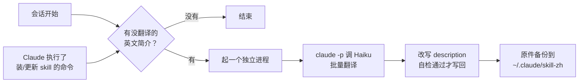

# skill-zh

[English](README.en.md) · [更新记录](CHANGELOG.md)

skill-zh 是一个 Claude Code 插件。装或更新 skill 之后，它在后台把英文简介完整翻译成中文，菜单里看到的就是中文。

```text
之前：Diagnosis loop for hard bugs and performance regressions. Use when the user says "diagnose"/"debug this" ...
之后：用于诊断困难的 bug 和性能回归的诊断流程。在用户说 "diagnose"/"debug this"、或报告某些东西已损坏/抛出异常/失败/运行缓慢时使用。
```

译文保留了原文里「什么时候用」的全部条件，引号里的触发词、命令和名字也保持原样，skill 的触发条件不会因为翻译而丢失。英文原文备份在本地，随时能改回去。

## 安装

在 Claude Code 里：

```text
/plugin marketplace add windery/skill-zh
/plugin install skill-zh@skill-zh
```

或者在终端：

```bash
claude plugin marketplace add windery/skill-zh
claude plugin install skill-zh@skill-zh
```

装好后开一个新会话，后台会把现有的英文简介翻一遍；再开下一个会话，菜单里就是中文了。

## 环境要求

- macOS 或 Linux
- Python 3.8 以上，命令名是 `python3`。macOS 自带的就行
- 已登录的 Claude Code，`claude` 命令在 `PATH` 里
- 可选：PyYAML。装了解析 SKILL.md 更稳，没装也能用

## 使用

平时不用管，下面两种情况会自动翻译：

- 开会话的时候
- Claude 执行了装或更新 skill 的命令之后，比如 `npx skills add`，或者往某个 `skills/` 目录里拷东西

需要手动操作时用下面三个命令。Claude 不会自动调用它们，它们也不占上下文：

| 命令 | 作用 |
| --- | --- |
| `/skill-zh:status` | 看每个 skill 的状态：已汉化、待翻译、本来就是中文、无简介 |
| `/skill-zh:translate` | 立刻翻译，不等下次会话 |
| `/skill-zh:restore` | 把改过的简介全部改回英文原文 |

## 配置

在 `/config` 里找到 skill-zh 那两行直接改，或者在 Claude Code 里运行 `/plugin configure skill-zh@skill-zh`：

| 配置项 | 默认值 | 说明 |
| --- | --- | --- |
| 翻译模型 `model` | `opus` | 调用 `claude -p` 翻译时用的模型，想省额度可以改成 `sonnet` |
| 不翻译的 skill `exclude` | 空 | 按 skill 文件夹名填写，多个用英文逗号分隔，例如 `ego-browser,agent-reach` |

改完重启 Claude Code 生效。

默认用 Opus 是测出来的：同一版提示词翻 30 条真实简介，再用同一套核对代理逐条打分，Haiku 有 8 条术语错译或改了触发条件（CI secrets 译成「秘密」、cutover 译成「转换」、agent 译成「代理」），Sonnet 和 Opus 都是 0 条，Opus 措辞最顺。翻译量很小，只翻新装或更新的 skill，30 条一分钟，模型差价可以忽略。

## 工作原理



1. 钩子触发。插件挂了 `SessionStart` 和 `PostToolUse`（Bash）两个钩子，都是 `async`，在后台运行，不会卡住会话。`PostToolUse` 只在 Bash 命令看起来像在装或更新 skill 时才继续。
2. 扫描。读每个 `SKILL.md` 开头的 `description`，分成已汉化、本来就是中文（汉字数不少于英文单词数）、待翻译三类，读不出简介的记为无简介。只夹了几个中文触发词的英文简介也算待翻译。判断「已汉化」看的是简介是否还和当初写进去的译文完全一致：作者更新 skill 后简介变回英文，下次开会话会重新翻译；你手动改成中文的算你自己的，不会被覆盖，也不会被改回英文。手动改成英文的和作者更新没法区分，会被重新翻译。
3. 起独立进程。有待翻译的简介时，翻译交给一个单独的进程。会话结束时，Claude Code 会取消还在运行的后台钩子，翻译如果放在钩子里就会中途被杀，`--debug` 日志里能看到 `Hook SessionStart:startup cancelled`。独立进程不在钩子的进程组里，会话关了也能跑完。
4. 翻译。用你自己的 Claude Code 登录调用 `claude -p --model opus`，每批 10 个，要求完整翻译并保留引号里的触发词。提示词里带一份术语对照表（secrets→密钥、cutover→切换）和一张保留英文的词表（agent、issue、PR、spec 这类），是核对了 30 条真实译文之后补上的。发出去的只有简介本身，键是序号，skill 名和路径都不发。译文以「`@@@ 键名` 加一段译文」的纯文本格式返回。没有用 JSON，是因为译文里常带英文引号，模型往往不转义，整段 JSON 就解析不了。回来的译文汉字数少于英文单词数的（模型拒答、半中半英）不收，下次重试。这个子会话不加载任何设置，也不给工具，里面没有插件和钩子，不会反过来再触发翻译。
5. 改写。把 `description` 换成一行中文译文，其他字段和正文原样保留。翻译要跑一两分钟，写回前先重读文件，期间被改过就放弃这次，下次按新内容重翻。然后重新解析一遍，确认简介已是新值、其他顶层字段一行没动才写回；没装 PyYAML 时只能做这种文本级比对。
6. 长度保护。Codex 等工具要求 `description` 不超过 1024 个字符，超了整个 skill 都加载不了。译文超长时不写入，保持原样。
7. 备份和并发。写回前先把原件和译文存到 `~/.claude/skill-zh/originals/`。几个会话同时打开时，文件锁保证只有一个进程在翻译；没抢到锁的直接放弃，不排队，它要翻的内容下次开会话时还在待翻译里。

### 为什么是完整翻译，不是一句话概括

Claude Code 里的 `description` 既显示在菜单里，也是模型判断什么时候该用这个 skill 的依据，没有单独的「显示用简介」字段。所以译文得是中文，同时不能丢掉作者写的使用条件和触发词。一句话概括会把这些压缩掉，skill 就可能不再自动触发。完整翻译并让引号里的原话保持原文，这两点都能满足。

0.1 和 0.2 版用的是「一句话概括 ｜ EN: 英文原文」的双语格式。升级后，这些简介会按备份里的英文原文重新完整翻译，而不是只删掉英文那一半。

## 管哪些目录

| 目录 | 谁在用 |
| --- | --- |
| `~/.agents/skills` | `npx skills` 的安装位置，Claude Code、Codex 等共用 |
| `~/.claude/skills`（跟随 `CLAUDE_CONFIG_DIR`） | Claude Code |
| `~/.codex/skills`（跟随 `CODEX_HOME`） | Codex，不含它自带的 `.system` |
| `~/.config/opencode/skills` | OpenCode |
| `~/.cursor/skills`、`~/.gemini/skills` | Cursor、Gemini CLI |

不碰的：

- 项目里的 `.claude/skills` 和 `.agents/skills`，免得在仓库里改出一堆 diff
- claude.ai 同步下来的 skill（`synced/` 子目录）和 Codex 自带的（`.system/` 子目录）
- 插件自带的 skill

几个目录用软链接指向同一个 skill 时，按真实路径只改一次。

## 隐私与数据

- 发给 Claude 翻译的只有 skill 的 `description`，正文不会发送。用的是你自己的 Claude Code 登录和额度，每次只翻新装或刚更新的 skill，量很小。
- 原件备份和日志存在 `~/.claude/skill-zh/`（设置了 `CLAUDE_CONFIG_DIR` 时在它下面）。这个目录新建时设为只有你自己能访问，卸载插件后也会保留。卸载前先运行 `/skill-zh:restore`；忘了的话，重新装上插件再运行一次，或者在源码目录里运行 `python3 skill_zh restore`。

## 局限

- 只有 Claude Code 有钩子。在 Codex 或终端里装的 skill，要等下次开 Claude Code 会话才会翻译；等不及就运行 `/skill-zh:translate`。
- 新译的简介从下一个会话开始显示。
- 译文质量只做粗检查（中文为主、不超长）。译得不好可以手动改，改过的不会再被覆盖。
- 简介手动改成英文的，和作者更新没法区分，会被重新翻译。
- 不支持 Windows。

## 故障排查

- **没反应**：先运行 `/skill-zh:status`，看那些 skill 是不是还在「待翻译」。再看日志 `~/.claude/skill-zh/log.txt`。
- **日志里写「翻译调用失败」**：在终端里运行 `claude -p "hi"`，确认 `claude` 能用，而且已经登录。
- **某个 skill 写「改写后校验没通过」**：它的 frontmatter 写法特殊，为了安全没有改动。可以附上那个 SKILL.md 提 issue。
- **不想要了**：先运行 `/skill-zh:restore` 改回英文，再运行 `claude plugin uninstall skill-zh@skill-zh`。

## 开发

```text
skill-zh/
├── .claude-plugin/
│   ├── plugin.json          插件清单和 userConfig
│   └── marketplace.json     让这个仓库本身可以当插件市场添加
├── hooks/
│   ├── hooks.json           SessionStart、PostToolUse 两个钩子
│   └── translate_hook.py    钩子入口，永远以 0 退出
├── skills/                  /skill-zh:status、translate、restore 三个命令
├── skill_zh/                核心代码
│   ├── catalog.py           找 skill、判断每个简介的状态
│   ├── commands.py          translate / restore 两个操作
│   ├── config.py            配置项和要管的目录
│   ├── frontmatter.py       读写 SKILL.md 里的 description
│   ├── hook.py              钩子逻辑，起独立的翻译进程
│   ├── state.py             状态目录、日志、锁、原件和译文记录
│   ├── text.py              判断文字是不是中文
│   ├── translator.py        调用 claude -p 翻译
│   └── cli.py               命令行
└── tests/
```

```bash
pip install pytest pyyaml ruff
pytest                       # 测试只用临时目录和假翻译，不碰你的 skill，也不调用 Claude
ruff check . && ruff format --check .
claude plugin validate . --strict
claude --plugin-dir .        # 不安装，直接带着本地插件开一个会话
```

在终端里也能直接运行核心代码：`python3 skill_zh status`。想在不碰真实文件的情况下试跑，用 `SKILL_ZH_SKILL_DIRS`（skill 目录，多个用 `:` 分隔）和 `SKILL_ZH_STATE_DIR`（状态目录）把它指到别处。

## License

[MIT](LICENSE)
