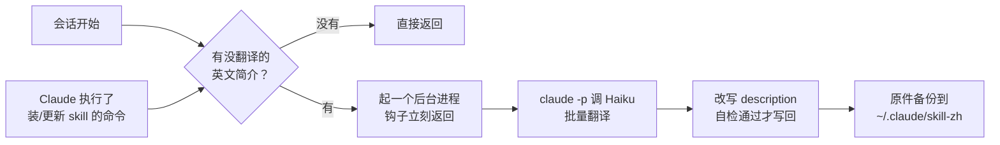

# skill-zh

装了一堆 skill，菜单里的简介全是英文，看着费劲。skill-zh 是一个 Claude Code 插件：装或更新 skill 之后，它在后台把英文简介翻成中文，加在原文前面。

```text
之前：Diagnosis loop for hard bugs and performance regressions. Use when the user says "diagnose"/"debug this" ...
之后：疑难 bug 和性能问题的诊断循环。用于用户要求诊断问题或报告功能异常、报错、失败或性能低下。 ｜ EN: Diagnosis loop for hard bugs and performance regressions. Use when the user says "diagnose"/"debug this" ...
```

英文原文一个字不删，所以 skill 什么时候被触发不受影响。

## 安装

在 Claude Code 里：

```text
/plugin marketplace add windery/skill-zh
/plugin install skill-zh@skill-zh
```

或者在终端：

```bash
claude plugin marketplace add windery/skill-zh
claude plugin install skill-zh@skill-zh
```

需要 Python 3.8 以上（macOS 和 Linux 一般自带）和已登录的 Claude Code。装了 PyYAML 解析更稳，没装也能用。

装好后开一个新会话，后台会把现有的英文简介翻一遍；再开下一个会话，菜单里就是中文了。

## 工作原理



1. **两个钩子触发**。`SessionStart` 在每次开会话时触发；`PostToolUse` 在 Claude 跑完 Bash 命令后触发，命令里像是在装或更新 skill（比如 `npx skills add`，或者往 `skills/` 目录里拷东西）才往下走。钩子本身只扫描文件，大约 0.1 秒；有活就起一个脱离会话的后台进程，不卡你。
2. **扫描**。读每个 `SKILL.md` 开头的 `description`，分成三类：已汉化（带 ` ｜ EN: `）、本来就是中文（中文字数不少于英文单词数）、待翻译。只夹了几个中文触发词的英文简介，算待翻译。
3. **翻译**。用你自己的 Claude Code 登录调用 `claude -p --model haiku`，每批 15 个，要求只输出 JSON。子进程不加载任何设置（`--setting-sources ""`）、不给工具，里面没有插件也没有钩子，所以不会反过来又触发自己。
4. **改写**。把 `description` 换成一行 `中文 ｜ EN: 英文原文`，其他字段和正文不动。写回前重新解析一遍，确认 `description` 变成了新值、其他字段一个不差，否则放弃这个文件。
5. **长度保护**。Codex 等工具对 `description` 有 1024 字符上限，超了整个 skill 会加载失败。加上中文会超长时，先截短中文；原文本身就快到上限的，直接跳过。
6. **备份和并发**。改之前把原件存到 `~/.claude/skill-zh/originals/`，随时能改回英文。多个会话同时开时，用一个目录锁保证只有一个在翻译。过程写进 `~/.claude/skill-zh/log.txt`。

skill 更新时简介会被覆盖回英文，下次开会话会自动重新翻译。

### 为什么不直接把简介换成中文

Claude Code 里的 `description` 有两个用途：在菜单里给人看，也给模型判断什么时候该用这个 skill。它没有单独的「显示用简介」字段。整段换成中文，作者写的英文触发词（比如 "diagnose"、"debug this"）就没了，触发效果可能变差。保留原文、中文放前面，菜单截断显示时先看到中文，模型照样读得到全部英文。

## 管哪些目录

| 目录 | 谁在用 |
| --- | --- |
| `~/.agents/skills` | `npx skills` 的安装位置，Claude Code、Codex 等共用 |
| `~/.claude/skills` | Claude Code |
| `~/.codex/skills` | Codex（不含它自带的 `.system`） |
| `~/.config/opencode/skills` | OpenCode |
| `~/.cursor/skills`、`~/.gemini/skills` | Cursor、Gemini CLI |

不碰的：项目里的 `.claude/skills`、`.agents/skills`（免得在仓库里改出一堆 diff），claude.ai 同步下来的 skill，插件自带的 skill。多个目录软链接到同一个 skill 的，按真实路径只改一次。

## 手动命令

脚本不依赖插件环境，插件缓存里那份、自己 clone 的那份都能直接跑：

```bash
SKILL_ZH="$(ls -d ~/.claude/plugins/cache/skill-zh/skill-zh/*/ | tail -1)scripts/skill_zh.py"
python3 "$SKILL_ZH" status     # 看每个 skill 的汉化状态
python3 "$SKILL_ZH" run        # 立刻翻译，不等下次会话
python3 "$SKILL_ZH" restore    # 全部改回英文原文
```

在 Codex 或终端里装的 skill 没有钩子可触发，跑一下 `run` 或者等下次开 Claude Code 会话就行。

## 配置

可选，写在 `~/.claude/skill-zh/config.json`：

```json
{
  "exclude": ["ego-browser"],
  "extra_dirs": ["~/my-skills"],
  "model": "haiku"
}
```

- `exclude`：不翻译的 skill，按文件夹名写
- `extra_dirs`：额外要管的 skill 目录
- `model`：翻译用的模型，默认 `haiku`

## 卸载

```bash
python3 "$SKILL_ZH" restore    # 可选：先把简介改回英文
claude plugin uninstall skill-zh@skill-zh
```

## 须知

- skill 简介会发给 Claude 做翻译，用的是你自己的 Claude Code 额度。每次只翻新装或刚更新的，量很小。
- 新译的简介从下一个会话开始显示。
- 只支持 macOS 和 Linux：钩子命令用的是 `python3`。

## 开发

```bash
python3 -m unittest discover -s tests -v
claude --plugin-dir .    # 不安装，直接带着本地插件开一个会话试
```

测试用临时目录和假翻译，不会碰你真实的 skill，也不会调用 Claude。可以用环境变量 `SKILL_ZH_DIRS`（skill 目录，多个用 `:` 分隔）和 `SKILL_ZH_STATE`（状态目录）把脚本指到别处试跑。

## License

[MIT](LICENSE)
