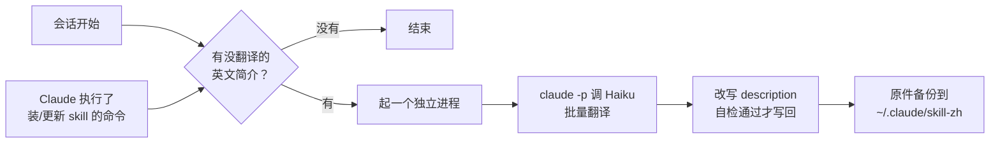

# skill-zh

[English](README.en.md) · [更新记录](CHANGELOG.md)

装了一堆 skill，菜单里的简介全是英文，看着费劲。skill-zh 是一个 Claude Code 插件：装或更新 skill 之后，它在后台把英文简介翻成中文，加在原文前面。

```text
之前：Diagnosis loop for hard bugs and performance regressions. Use when the user says "diagnose"/"debug this" ...
之后：疑难 bug 和性能问题的诊断循环。用于用户要求诊断问题或报告功能异常、报错、失败或性能低下。 ｜ EN: Diagnosis loop for hard bugs and performance regressions. Use when the user says "diagnose"/"debug this" ...
```

英文原文一个字不删，所以 skill 什么时候被触发不受影响。

## 安装

在 Claude Code 里：

```text
/plugin marketplace add windery/skill-zh
/plugin install skill-zh@skill-zh
```

或者在终端：

```bash
claude plugin marketplace add windery/skill-zh
claude plugin install skill-zh@skill-zh
```

装好后开一个新会话，后台会把现有的英文简介翻一遍；再开下一个会话，菜单里就是中文了。

## 环境要求

- macOS 或 Linux
- Python 3.8 以上，命令名是 `python3`。macOS 自带的就行
- 已登录的 Claude Code，`claude` 命令在 `PATH` 里
- 可选：PyYAML。装了解析 SKILL.md 更稳，没装也能用

## 使用

平时不用管，下面两种情况会自动翻译：

- 开会话的时候
- Claude 执行了装或更新 skill 的命令之后，比如 `npx skills add`，或者往某个 `skills/` 目录里拷东西

想手动操作，用这三个命令。它们只能你自己调用，Claude 不会自己触发，也不占上下文：

| 命令 | 作用 |
| --- | --- |
| `/skill-zh:status` | 看每个 skill 的状态：已汉化、待翻译、本来就是中文 |
| `/skill-zh:translate` | 立刻翻译，不等下次会话 |
| `/skill-zh:restore` | 把改过的简介全部改回英文原文 |

## 配置

在 `/config` 里找到 skill-zh 那两行直接改，或者在 Claude Code 里运行 `/plugin configure skill-zh@skill-zh`：

| 配置项 | 默认值 | 说明 |
| --- | --- | --- |
| 翻译模型 `model` | `haiku` | 调用 `claude -p` 翻译时用的模型 |
| 不翻译的 skill `exclude` | 空 | 按 skill 文件夹名填写，多个用英文逗号分隔，例如 `ego-browser,agent-reach` |

改完重启 Claude Code 生效。

## 工作原理



1. **钩子触发**。插件挂了 `SessionStart` 和 `PostToolUse`（Bash）两个钩子，都是 `async`，在后台跑，不卡会话。Bash 命令看起来像在装或更新 skill，才继续往下走。
2. **扫描**。读每个 `SKILL.md` 开头的 `description`，分成已汉化（带 ` ｜ EN: `）、本来就是中文（中文字数不少于英文单词数）和待翻译三类。只夹了几个中文触发词的英文简介，也算待翻译。
3. **起独立进程**。有待翻译的，就单独起一个进程去翻。为什么不直接在钩子里翻：会话结束时，Claude Code 会把还在跑的后台钩子取消掉，翻译就会半途被杀。用 `--debug` 看得到这条 `Hook SessionStart:startup cancelled`。独立进程不在钩子的进程组里，会话关了也能跑完。
4. **翻译**。用你自己的 Claude Code 登录调用 `claude -p --model haiku`，每批 15 个，要求只返回 JSON。这个子会话不加载任何设置、不给工具，里面没有插件也没有钩子，不会反过来又触发翻译。
5. **改写**。把 `description` 换成一行 `中文 ｜ EN: 英文原文`，其他字段和正文一个字节都不动。写回前重新解析一遍，确认简介变成了新值、其他字段没变，才真正写回。
6. **长度保护**。Codex 等工具要求 `description` 不超过 1024 个字符，超了整个 skill 都加载不了。加上中文会超长时，先截短中文；原文本身就快到上限的，直接跳过。
7. **备份和并发**。写回前先把原件存到 `~/.claude/skill-zh/originals/`。几个会话同时打开时，用文件锁保证只有一个进程在翻译。

skill 更新时简介会被覆盖回英文，下次开会话会自动重新翻译。

### 为什么不直接把简介换成中文

Claude Code 里的 `description` 有两个用途：在菜单里给人看，也给模型判断什么时候该用这个 skill。它没有单独的「显示用简介」字段。整段换成中文，作者写的英文触发词（比如 "diagnose"、"debug this"）就没了，skill 可能就不会自动触发了。保留原文、中文放前面：菜单显示不全时先看到中文，模型照样读得到全部英文。

## 管哪些目录

| 目录 | 谁在用 |
| --- | --- |
| `~/.agents/skills` | `npx skills` 的安装位置，Claude Code、Codex 等共用 |
| `~/.claude/skills`（跟随 `CLAUDE_CONFIG_DIR`） | Claude Code |
| `~/.codex/skills`（跟随 `CODEX_HOME`） | Codex，不含它自带的 `.system` |
| `~/.config/opencode/skills` | OpenCode |
| `~/.cursor/skills`、`~/.gemini/skills` | Cursor、Gemini CLI |

不碰的：

- 项目里的 `.claude/skills` 和 `.agents/skills`，免得在仓库里改出一堆 diff
- claude.ai 同步下来的 skill
- 插件自带的 skill

几个目录用软链接指向同一个 skill 时，按真实路径只改一次。

## 隐私与数据

- 只有 skill 的 `description` 会发给 Claude 做翻译，正文不会。用的是你自己的 Claude Code 登录和额度，每次只翻新装或刚更新的，量很小。
- 原件备份和日志都存在 `~/.claude/skill-zh/`（设置了 `CLAUDE_CONFIG_DIR` 时在它下面）。这个目录新建时设为只有你自己能访问。卸载插件后它还在，所以卸载以后也能改回英文。

## 局限

- 只有 Claude Code 有钩子。在 Codex 或终端里装的 skill，要等下次开 Claude Code 会话才会翻译；等不及就运行 `/skill-zh:translate`。
- 新译的简介从下一个会话开始显示。
- 不支持 Windows。

## 故障排查

- **没反应**：先运行 `/skill-zh:status`，看那些 skill 是不是还在「待翻译」。再看日志 `~/.claude/skill-zh/log.txt`。
- **日志里写「翻译调用失败」**：在终端里运行 `claude -p "hi"`，确认 `claude` 能用，而且已经登录。
- **某个 skill 写「改写后校验没通过」**：说明它的 frontmatter 写法特殊，为了安全没改它。欢迎附上那个 SKILL.md 提 issue。
- **不想要了**：先运行 `/skill-zh:restore` 改回英文，再运行 `claude plugin uninstall skill-zh@skill-zh`。

## 开发

```text
skill-zh/
├── .claude-plugin/
│   ├── plugin.json          插件清单和 userConfig
│   └── marketplace.json     让这个仓库本身可以当插件市场添加
├── hooks/
│   ├── hooks.json           SessionStart、PostToolUse 两个钩子
│   └── translate_hook.py    钩子入口，永远以 0 退出
├── skills/                  /skill-zh:status、translate、restore 三个命令
├── skill_zh/                核心代码
│   ├── catalog.py           找 skill、判断状态、拼中英文简介
│   ├── commands.py          status / translate / restore 三个操作
│   ├── config.py            配置项和要管的目录
│   ├── frontmatter.py       读写 SKILL.md 里的 description
│   ├── hook.py              钩子逻辑，起独立的翻译进程
│   ├── state.py             状态目录、日志、锁、备份
│   ├── translator.py        调用 claude -p 翻译
│   └── cli.py               命令行
└── tests/
```

```bash
pip install pytest pyyaml ruff
pytest                       # 测试只用临时目录和假翻译，不碰你的 skill，也不调用 Claude
ruff check . && ruff format --check .
claude plugin validate . --strict
claude --plugin-dir .        # 不安装，直接带着本地插件开一个会话
```

在终端里也能直接运行核心代码：`python3 skill_zh status`。想在不碰真实文件的情况下试跑，用 `SKILL_ZH_SKILL_DIRS`（skill 目录，多个用 `:` 分隔）和 `SKILL_ZH_STATE_DIR`（状态目录）把它指到别处。

## License

[MIT](LICENSE)
